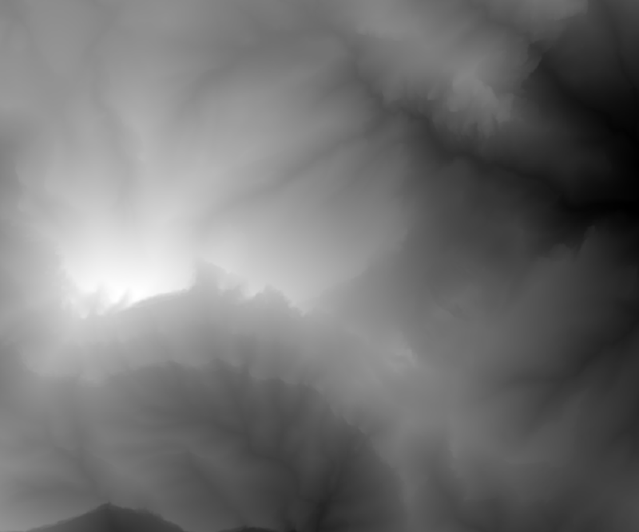
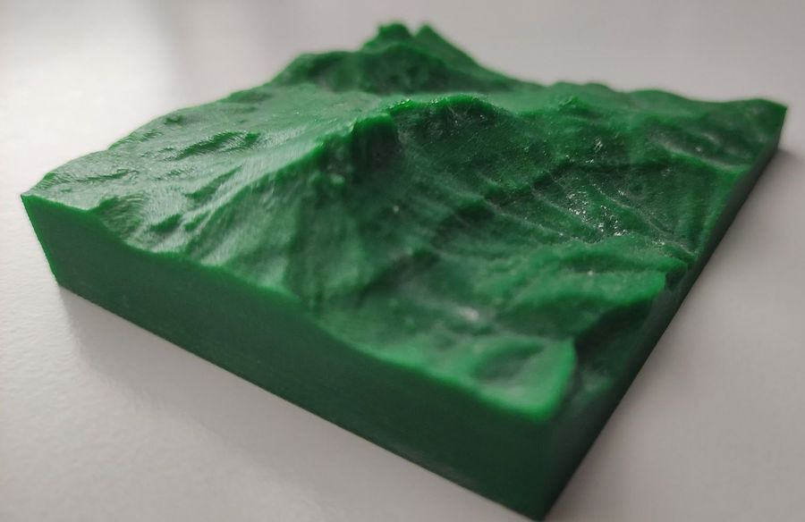

# DEM 2 OBJ (Rust edition)
##Introduction 

This is a little program that allows you to convert files from the DEM (ESRI .asc) elevation maps to .OBJ (solid 3d).

##Motivation

The main goal of the program is to print elevation maps in a 3D printer. The obj format can be processed  by any slicer software like: Cura, simplyfy3D, Slicer, etc.

From this: 

to this:


There are great websites that allow you to do that but only from the sources they implemented.

##Usage

Run with cargo
    
        ```
        cargo run .\test\Penyagolosa2m.asc .\test\Penyagolosa2m.obj
        ```

Run the binary

        ```
        dem_2_obj.exe  .\test\Penyagolosa2m.asc .\test\Penyagolosa2m.obj
        ```

Run 3rd optional parameter (elevation modifier) to exagerate elevation:

        ```
        dem_2_obj.exe  .\test\Penyagolosa2m.asc .\test\Penyagolosa2m.obj 1000
        ```

Example values for the elevation modifier parameter:
    * 500: 2x Spipkyness
    * 1000: Without modifications
    * 2000: 0.5x Spikyness

